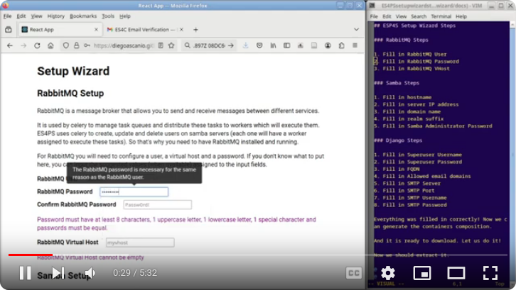
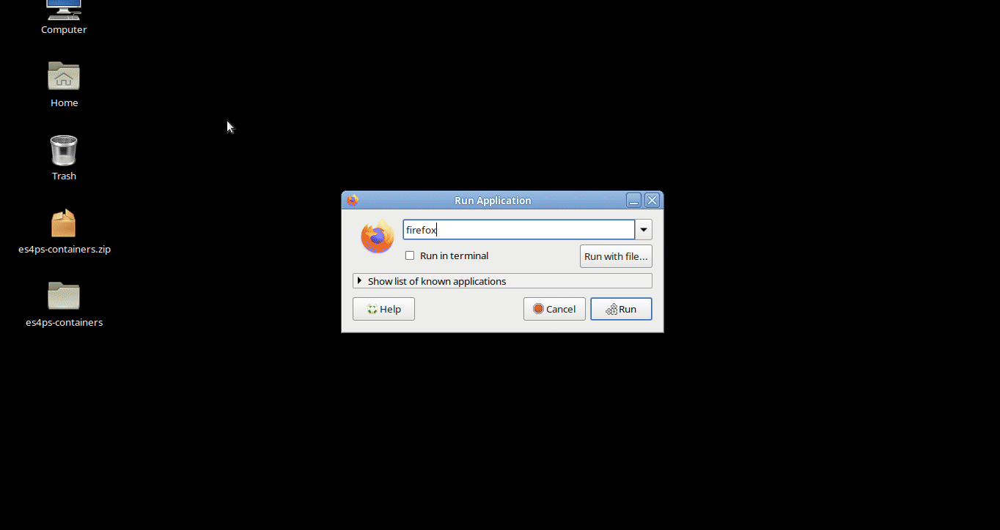
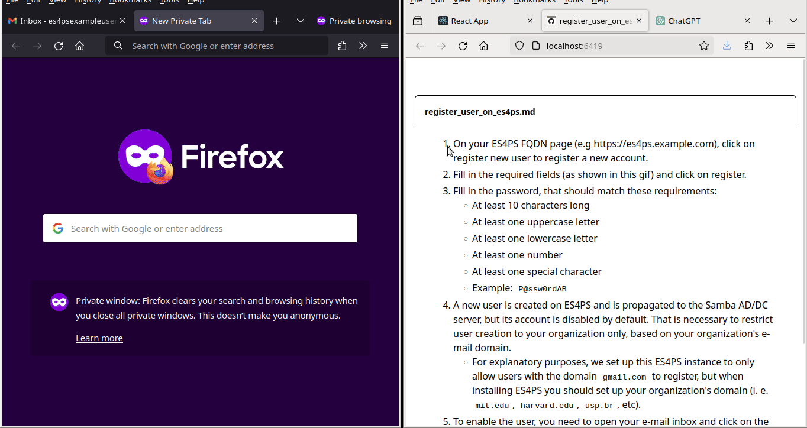
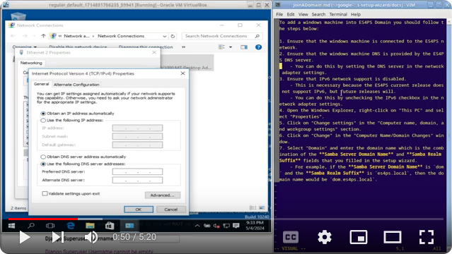
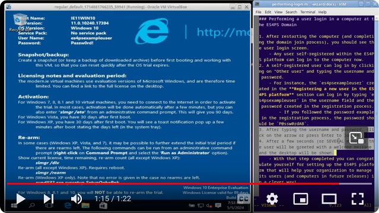

# ES4All — Simplifying SAMBA AD/DC Setup for Academic and Institutional Use

The Easy SAMBA for All (ES4All) Platform addresses a significant challenge in the deployment and management of SAMBA Active Directory/Domain Controller (AD/DC) services: complexity. Traditional setups of SAMBA, despite its robust features and stability, are often hindered by intricate configuration processes that can deter IT staff, particularly in environments with constrained resources or high operational demands. ES4All leverages Docker container technology to streamline these processes, offering a simplified, accessible, and efficient approach to SAMBA server setup.

It also frees IT staff from the burden of manual user management by providing a web interface for self-registration, enabling end-users to easily join the network and access resources. This self-registration feature enhances user experience, reduces administrative overhead, and improves overall network security by ensuring only authorized users can access the system.

The Platform is particularly well suited for academic institutions and organizations seeking cost-effective and easy-to-set-up alternatives to proprietary AD/DC solutions. With ES4All, organizations can harness the full potential of SAMBA AD/DC services, improving network management and user isolation in a secure and manageable manner.

## Features

- **Simplified Setup**: ES4All simplifies the deployment of SAMBA AD/DC services by leveraging Docker containers, reducing the complexity of traditional setups.
- **Web Interface**: The platform provides a web interface for self-registration, enabling end-users to easily join the network and access resources.
- **User Management**: ES4All automates user management, reducing administrative overhead and improving network security.
- **Cost-Effective**: The platform offers a cost-effective alternative to proprietary AD/DC solutions, making it ideal for academic institutions and organizations with constrained resources.

## Requirements

To run the ES4All platform, you should have a Linux host with  docker and docker-compose installed. Follow the [docker instructions](https://docs.docker.com/engine/install/) appropriate to your distro to install the docker engine and [these instructions](https://docs.docker.com/compose/install/linux/) to install docker-compose.

Unfortunately, the ES4All platform is not supported in Windows and MacOS systems at the moment, as docker in these systems does not support the `host` network mode, which is necessary to run the Samba AD/DC server. You could run the ES4All platform in a Linux virtual machine in these systems, but it is not recommended due to performance issues.

Finally, you should have a A SMTP STARTTLS capable e-mail account with its user and password to send e-mails.

- We recommend using Microsoft e-mail accounts (like @outlook.com,
  @live.com, @hotmail.com) as they support SMTP starttls encryption
  and don't require additional settings to run as Gmail accounts do.
    - To register a new account, go to [outlook.com](https://outlook.live.com/owa/)
      and click on the "Create account" button.
- If you want to use a Gmail account, you should allow less secure apps
  to access your account and disable the two-factor authentication. This README will not show how to do that, but you can find this information on your favorite search engine.

## Installation

Head over [ES4All Setup Wizard](https://diegoascanio.github.io/es4ps-setup-wizard/) and then fill in the required fields. After filling everything required, click on the `generate containers composition` button to create a zip file with the necessary files to run the ES4All platform. Then download this file and extract the zip file to get the files needed to run the ES4All platform.

If you get stuck in any step head to the [ES4All setup-wizard README file](https://github.com/DiegoAscanio/es4ps-setup-wizard/blob/main/README.md) to get more information about the setup wizard or watch the video below to see how to run the setup wizard:

[](https://youtu.be/-ymDxufMSNc?si=GFGq1qqZ9Mj8khlb)

## Usage

As the samba container require the `host` network mode to run as well as the `privileged` mode, ensure that your user has the necessary permissions to run docker commands. You can do this by adding your user to the `docker` group:

```bash
sudo usermod -aG docker $USER
```

After adding your user to the `docker` group, log out and log in again to apply the changes. Now you're able to build and run the ES4All platform.

To do so, go to the folder where you extracted the zip file generated by the setup wizard and run the following commands:

```bash
bash build.sh ## This will build the containers # This will build the containers and should be run only once
bash start.sh ## This will start the containers
```

After running the commands to build and start the ES4All platform, everything should be up and running. You can access the platform by browsing the address defined as **ES4All Fully Qualified Domain Name (FQDN)** in the setup wizard's Django setup section. Add an exception in your browser to access the platform, as the certificates are self-signed and not recognized by the browser:



If you entered the **ES4All Fully Qualified Domain Name (FQDN)** as a domain that doesn't exist in the internet (or in your local network's DNS server) such as `es4ps.example.com`, you should add an entry in your OS hosts file bonding this domain to the IP address of the machine that is running the ES4All platform, otherwise, your browser will always show a **site not found** error.

To do so in a Linux distro, you should run the following command:

```bash
sudo echo "${SERVER_IP_ADDRESS} ${ES4All_FQDN}" >> /etc/hosts
```

where `${SERVER_IP_ADDRESS}` is the IP address of the machine that is running the ES4All platform (i.e, 192.168.0.100) and `${ES4All_FQDN}` is the **ES4All Fully Qualified Domain Name (FQDN)** you filled in the setup wizard (i.e. `es4ps.example.com`).

In a Windows machine, you should open the file `C:\Windows\System32\drivers\etc\hosts` with a text editor with administrator privileges and add the following line:

```
${SERVER_IP_ADDRESS} ${ES4All_FQDN}
```

where `${SERVER_IP_ADDRESS}` is the IP address of the machine that is running the ES4All platform (i.e, 192.168.0.100) and `${ES4All_FQDN}` is the **ES4All Fully Qualified Domain Name (FQDN)** you filled in the setup wizard (i.e. `es4ps.example.com`).

For any users and hosts within your network that can't access the ES4All plaftorm, they can solve this issue by editing their hosts file as well. For the ES4All domain computers it will not be necessary to edit the hosts file, as they will use the ES4All DNS server and the `ES4All_FQDN` will be resolved to the correct IP address by samba internal DNS server.

And lastly but not least, users (hosts) within your network that are not willing to edit their hosts file can set their machines to use the DNS server provided by Samba AD/DC server with the server's IP address.

Pay attention to the fact that the settings above are only necessary if you filled the **ES4All Fully Qualified Domain Name (FQDN)** field in the setup wizard with a domain that doesn't exist in the internet (or in your local network's DNS server). For an already resolvable domain, these steps are not necessary.

### Registering a new user in the ES4All platform

Any user within your organization should access the platform website to create their accounts and execute the following steps:

1. Click the `register new user` button to create a new account on the ES4All FQDN page (e.g., https://es4ps.example.com).
2. Fill the required fields and click on register.
    1. The password, that should match the following requirements:
        - At least ten characters long
        - At least one uppercase letter
        - At least one lowercase letter
        - At least one number
        - At least one special character
        - Example: `P@ssw0rdAB`
    - After the user fills out the mandatory fields, a new account is created on ES4All and propagated to the Samba AD/DC server, but this new account is disabled by default to restrict user creation to your organization only based on your organization's e-mail domain and verify the user's tie to the organization.
3. To enable their account, the user needs to open their e-mail inbox, click on the activation link sent by the ES4All platform, or input the activation code manually.
    - When a user is verified (activated), a Celery task on ES4All is triggered to enable its account on the Samba AD/DC server. After this step, any verified user will be able to log in on any computer within the domain.

Now you'll see the user POV when creating its account in the ES4All platform (and verifying it) to be able to login in Windows clients in your organization's network:



### Adding a computer to the ES4All Domain

To add a Windows machine to the ES4All Domain, you should follow the steps below:

1. Ensure that the Windows machine is connected to the ES4All network.
2. Ensure that the Windows machine DNS is provided by the ES4All DNS server.
    - You can do this by setting the DNS server in the network adapter settings.
    - This IP address is the **Samba Server IP Address** you filled in the setup wizard.
3. Ensure that IPv6 network support is disabled.
    - This is necessary because the ES4All current release does not support IPv6, but future releases will.
    - You can do this by unchecking the IPv6 checkbox in the network adapter settings.
4. Now, open the Windows Explorer, right-click on "This PC" and select "Properties".
5. Click on "Change settings" in the "Computer name, domain, and workgroup settings" section.
6. Click on "Change" in the "Computer Name/Domain Changes" window.
7. Select "Domain" and enter the domain name, which combines the **Samba Server Domain Name** and **Samba Realm Suffix** fields you filled out in the setup wizard.
    - For example, if the **Samba Server Domain Name** is `dom` and the **Samba Realm Suffix** is `es4ps.local`, then the domain name would be `dom.es4ps.local`.
8. Click "OK" and enter **Administrator** as Username and **Samba Server Administrator Password** that you filled in the setup wizard as the Password.
9. Joining the domain will take a few seconds to a few minutes. So, grab a cup of coffee and wait.
    - Some tools, like FOG (Free Open-source Ghost), can automate this process so you can join the domain without any manual intervention. This automation is extremely useful in scenarios like computer labs, and a future ES4All release will cover the integration between FOG and ES4All.
10. After a few minutes, you'll be greeted with a welcome message into the domain, and then, after a few seconds, you'll be asked to restart the computer. Proceed with that.

If you'd like to watch a video showing these steps, you can do it by clicking on the link bellow (CTRL + click to open in a new tab):

[](https://youtu.be/jz6siqBeISo?si=LDht0y476ldt1SR5)

### Performing a user login in a computer at the ES4All Domain

1. After restarting the computer (and completing the domain join process), you should see the user login screen.
    - Any user self-registered within the ES4All platform can log in to the computer now.
2. A self-registered user can log in by clicking on "Other user" and typing the username and password.
    - For instance, the `es4psexampleuser` created in the **Registering a new user in the ES4All platform** section can log in by typing `es4psexampleuser` in the username field and the password created in the registration process.
        - If you followed the password example in the registration process, the password should be `P@ssw0rdAB`.
3. After typing the username and password, click on the arrow or press Enter to log in.
4. After a few seconds (or SEVERAL minutes) the user will be greeted with a welcome message and the desktop will be shown.
    - With that step completed you can congratulate yourself for setting up the ES4All platform that will help your organization to manage its users (and computers in future releases) in a clever way!

A video showing the user login process in a computer at the ES4All Domain is available by clicking on the link bellow (CTRL + click to open in a new tab):

[](https://www.youtube.com/watch?v=qrGbnNZRY2M)

## Code Availability

The ES4All Platform is available in two repositories besides this one:

1. [ES4All containers repository](https://github.com/DiegoAscanio/es4ps-containers/): This repository contains the Dockerfiles and the docker-compose.yaml file necessary to build and run the ES4All Platform.
2. [ES4All setup-wizard repository](https://github.com/DiegoAscanio/es4ps-setup-wizard): This repository contains the source code of the setup-wizard web interface that guides the IT staff through the process of setting up the necessary parameters to deploy the SAMBA AD/DC server in their organization. It also contains instructions on how to set up ES4All in an organization.

## Proof of Concept

There's a proof of concept of the platform built through Containers and Virtual Machines available at [https://github.com/DiegoAscanio/es4all-proof-of-concept/](https://github.com/DiegoAscanio/es4all-proof-of-concept/) where you can see the ES4All Platform in action. For doing so you need to enable intel (amd) virtualization support in your computer's BIOS, enable nested virtualization in your computer as well, and have at least 8GB of RAM and 4 CPU cores available to the virtual machines.

This proof-of-concept consists of a docker container that hosts three virtual machines: 

1. A VM that runs the ES4All Platform;
2. A second with a Windows 10 Enterpirse Trial Edition VM that is set up to join to the ES4All Platform's domain;
3. A third one with a minimal Linux VM for users self-registration.

The Windows VM is meant to demonstrate the user management capabilities of the ES4All Platform and it is not distributed as a ready OS installation. For being a trial edition that would expire after 90 days of installation if the windows VM came already setup, infringements of Microsoft intellectual property would happen after this period.

For this reason, the Windows VM is distributed as an unattended installation setup that installs Windows automatically so it'll take some time to install the OS.

## Final considerations

The ES4All platform is a powerful tool that can help your organization to manage its users and computers in a clever way. This platform is under active development, and new features will be added in the future. 

As the ES4All platform is in its first release, it is a minimal viable product (MVP) that focus on enabling user authentication (and login) in Windows Computers within your organization's network.

If you have any questions, suggestions, or want to contribute to the project, please contact us at [ascanio@cefetmg.br](mailto:ascanio@cefetmg.br).
