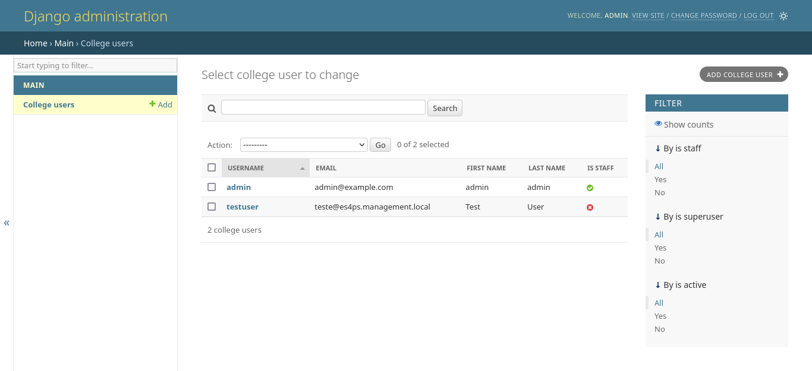
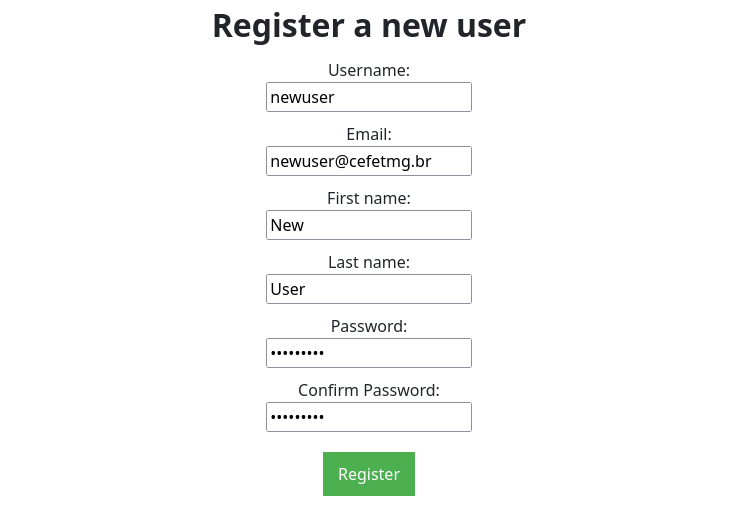

# Summary

The Easy SAMBA for All (ES4All) Platform addresses a significant challenge in the deployment and management of SAMBA Active Directory/Domain Controller (AD/DC) services: complexity. Traditional setups of SAMBA, despite its robust features and stability, are often hindered by intricate configuration processes that can deter IT staff, particularly in environments with constrained resources or high operational demands. ES4All leverages Docker container technology to streamline these processes, offering a simplified, accessible, and efficient approach to SAMBA server setup.

It also frees IT staff from the burden of manual user management by providing a web interface for self-registration, enabling end-users to easily join the network and access resources. This self-registration feature enhances user experience, reduces administrative overhead, and improves overall network security by ensuring only authorized users to access computers managed by the SAMBA AD/DC server.

The Platform is particularly well suited for academic institutions and organizations seeking cost-effective and easy-to-set-up alternatives to proprietary AD/DC solutions. With ES4All, organizations can harness the full potential of SAMBA AD/DC services, improving network management and user isolation in a secure and manageable manner.

# Statement of Need

Misuse in computer labs can harm students' rights to learn and perform experiments in these spaces, so it is necessary to identify each student who uses a lab computer to mitigate such threats. Furthermore, there are cases where no intentional harm is produced, i.e., when someone accidentally deletes a file on a computer that was in use by another person, so besides identification, some level of isolation between users is appreciated.

An Active Directory / Domain Controller service provides ways to achieve these goals. However, the state-of-the-art software — Microsoft Active Directory and Domain Controller from @microsoft_corporation_the_microsoft_1999 — cannot be used in universities for several reasons such as:

Continuous budget cuts in public universities—@lima_culture_2020, @amigo_bill_2020, and @altundemir_impact_2012—drain money that, if available, could be used to acquire licenses for Microsoft Windows Server OS (which bundles AD/DC service within yourself).
- United States Sanctions against some countries like Cuba, Russia, Iran, North Korea, and others forbid American companies (and individuals) from doing business in these countries, and this prohibition applies to Microsoft Corporation as it is an American Company, so Microsoft cannot provide its services within these places, leaving these countries' universities (and all other businesses) excluded from access to Microsoft AD/DC software [@us_department_of_treasury_sanctions_2022].
Severe fines caused by unfair use of proprietary software (piracy) can permanently harm any business that dares to, as it happened to the Brazilian private university Candido Mendes, which had its campus put up for auction to provide financial resources for the payment of a R$42 million fine to Microsoft caused by pirate Windows 98 OS installations on Candido Mendes' computers [@setti_rennan_predio_2016].

Therefore, free (and open source) software to provide AD/DC services is necessary to address these issues, and for the current state of affairs, there is one free and open source software capable of doing so: SAMBA. Since 1991, SAMBA has been developed to promote integration between Windows and Unix networks and, nowadays, can function as a domain controller, providing the necessary means to manage users and computers in a network [@samba_team_the_samba_2024].

Although SAMBA's resiliency and stability in providing AD/DC functionalities, its setup is somewhat complex, as @vazquez_practical_2019 notices. These eventual complexities restrain many IT staff from implementing SAMBA in their organizations since they need to deal with complex and labor-intensive tasks in their daily duties — @Goldszmidt1998Delegated — or maybe overwhelmed with high workloads as @Prabaswari2019The observes.

To address such complexities and to provide a way to set up an AD/DC SAMBA server easily, we present the Easy SAMBA for All (ES4All) Platform, a free and opensource application that provides through the advantages and conveniences offered by Docker containers[^1]:

- A web interface where users can self-register into the AD/DC SAMBA server with e-mail domain verification (optional) to restrict registration to users within the organization, leaving outsiders unable to register themselves.
- A container composition that abstracts the complexities of getting a SAMBA AD/DC server up and running.
- A setup-wizard web interface that guides the IT staff through setting up the necessary parameters to deploy the SAMBA AD/DC server in their organization.

[^1]: A container image is a lightweight, executable package that includes everything needed to run the software: code, runtime, tools, libraries, and settings. Compatible with Linux and Windows, containers ensure consistent performance across environments by isolating software. However, the Windows version may lack some features that are available on Linux. Docker is a popular Platform that simplifies the deployment and management of these containers, facilitating scalability and reducing conflicts in shared infrastructures. [@microsoft_corporation_implementing_2018;@docker_inc_docker_2022].

# Description

Docker containers provide the foundation that makes ES4All possible. The main services provided by the ES4All Platform — in its current state — could be supplied by only three modules (each one isolated within a container), as shown in the figure below:

{width=100%}

These three modules are described as follows:

1. **Samba AD/DC worker**: This module is responsible for providing an AD/DC SAMBA server and a user modification interface that allows other modules — such as the Web Interface — to manage users in the network. This interface is made possible through Celery, a distributed task queue that enables the execution of asynchronous tasks (called by issuers) by one or multiple workers. In this case, the Django Web Interface issues tasks to the Samba AD/DC worker to manage users in the network.
2. **Django web interface**: This module provides a web interface where users can self-register into the AD/DC SAMBA server. It was developed using Django to accelerate the development process through the batteries available in the Django framework, such as the ORM, the admin interface, the authentication system, the template engine, and the Celery integration to issue tasks to the Samba AD/DC worker.
3. **RabbitMQ server**: This server is the backbone for Celery as it provides an Advanced Message Queuing Protocol (AMQP) that Celery uses to transit tasks as messages. Currently, tasks issued by the Django Web Interface are sent to the RabbitMQ server and then consumed by the Samba AD/DC worker.

Besides these three modules (that makes it necessary to run at least three containers), there are two other containers necessary to provide the ES4All Platform:

1. **init-certificates**: This container is responsible for generating self-signed certificates to provide secure connections between Celery issuers and workers to the RabbitMQ server, as well; it is responsible for generating self-signed SSL certificates to provide https connections between the Django Web Interface and the users. Certificates are generated only once, although the container checks every time it runs to see if the certificates have already been generated. If not, it generates them.
2. **reverse-proxy**: This container, using Nginx, provides a reverse proxy to the Django Web Interface to properly manage https connections for users. It is responsible for loading the self-signed SSL certificates generated by the init-certificates container and redirecting incoming http requests to https and subsequent requests to the Django Web Interface.

All these modules are orchestrated by Docker Compose, a tool that allows the definition and running of multi-container Docker applications through a YAML file called docker-compose.yaml, where all services, dependencies, networks, and volumes (for data persistence) are defined.

How does this composition work? It expects necessary environment variables to be forwarded to the containers that need them, such as the Samba Administrator Password (SERVER_ADMIN_PASSWORD) and the RabbitMQ password (RABBITMQ_DEFAULT_PASS). These variables are defined in a .env file that needs to be loaded before running the proper docker-compose command to start the ES4All Platform. So, any IT staff who wants to deploy the ES4All Platform in their organization would need to create this .env file and load it before running the docker-compose command.

Fortunately, the ES4All Platform provides a [setup-wizard](https://diegoascanio.github.io/es4ps-setup-wizard) web interface that guides the IT staff through the process of setting up the necessary parameters to deploy the SAMBA AD/DC server in their organization. This setup wizard is responsible for reading the variables' values from an HTML form (filled by IT staff) and writing them into a .env file, which is appended into a zip file containing the docker-compose.yaml file and the other containers' configuration files needed to run the ES4All Platform. Then, the IT staff downloads and extracts this zip file into the server where the ES4All Platform is set for deployment.

After performing these steps, all that an IT staff needs to do is to build the container composition through the `build.sh` script and then run the ES4All Platform through the `run.sh` script. The ES4All Platform will be up and running and: 

- IT staff can access the Django Web Interface through the browser to manage users, as shown in Figure 2;
- Users can access the Django Web Interface through the browser to self-register into the AD/DC SAMBA server, as shown in Figure 3.

There are documents explaining how to use the setup wizard and how the ES4All Platform containers work. These are available, correspondingly:

1. [ES4All Setup Wizard Repository's README](https://github.com/DiegoAscanio/es4ps-setup-wizard/blob/main/README.md)
2. [ES4All Containers Repository's README](https://github.com/DiegoAscanio/es4ps-containers/blob/main/README.md)

There are also available in these documents, descriptions of the steps taken to develop each of them, and such descriptions are useful for:

- Understanding how the setup-wizard and the ES4All Platform containers work;
- Contributing to the development of these repositories.

Finally, there's a proof of concept of the platform built through Containers and Virtual Machines available at [https://github.com/DiegoAscanio/es4all-proof-of-concept/](https://github.com/DiegoAscanio/es4all-proof-of-concept/) where you can see the ES4All Platform in action. For doing so you need to enable intel (amd) virtualization support in your computer's BIOS, enable nested virtualization in your computer as well, and have at least 8GB of RAM and 4 CPU cores available to the virtual machines.

This proof-of-concept consists of a docker container that hosts three virtual machines: 

1. A VM that runs the ES4All Platform;
2. A second with a Windows 10 Enterpirse Trial Edition VM that is set up to join to the ES4All Platform's domain;
3. A third one with a minimal Linux VM for users self-registration.

The Windows VM is meant to demonstrate the user management capabilities of the ES4All Platform and it is not distributed as a ready OS installation. For being a trial edition that would expire after 90 days of installation if the windows VM came already setup, infringements of Microsoft intellectual property would happen after this period.

For this reason, the Windows VM is distributed as an unattended installation setup that installs Windows automatically so it'll take some time to install the OS.

# Code Availability

The ES4All Platform is available in two repositories:

1. [ES4All containers repository](https://github.com/DiegoAscanio/es4ps-containers/): This repository contains the Dockerfiles and the docker-compose.yaml file necessary to build and run the ES4All Platform.
2. [ES4All setup-wizard repository](https://github.com/DiegoAscanio/es4ps-setup-wizard): This repository contains the source code of the setup-wizard web interface that guides the IT staff through the process of setting up the necessary parameters to deploy the SAMBA AD/DC server in their organization. It also contains instructions on how to set up ES4All in an organization.

# Conclusion

The ES4All Platform allows IT staff to easily set up an AD/DC SAMBA server in their organization, providing a web interface where users can self-register into the AD/DC SAMBA server. This Platform is made possible through the advantages and conveniences offered by Docker containers, which abstract the complexities of getting a SAMBA AD/DC server up and running.

The Platform represents a great benefit for all institutions that need AD/DC services but are unable to use the Microsoft Active Directory and Domain Controller software for any reason. A prime example of the Platform's usefulness is seen in academic environments, where ES4All can identify end-users (students, teachers, researchers) in computers and isolate such users from each other, mitigating threats and accidental harms that might happen in a computer network.

These features provide — with the absence of doubt — better conditions for academic end-users to perform their activities (learning, teaching, researching) in a computer network. Furthermore, the simplification and automation (through user self-registration) of the user management process in the network frees up IT staff to focus on other critical functions, improving, as a result:

1. The overall efficiency of the organization;
2. The productivity (and possibly job satisfaction) of the IT staff;
3. The quality of the services provided by the organization to its end-users.

# Acknowledgements

We acknowledge the support of the IT and Computer Engineering departments from Centro Federal de Educação Tecnológica de Minas Gerais, Brazil, for providing the necessary resources to develop the ES4All Platform.

# References
